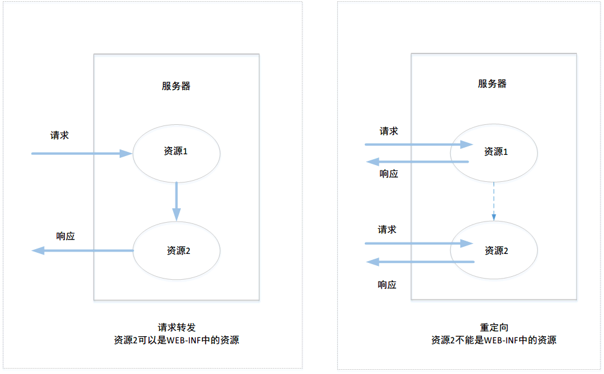
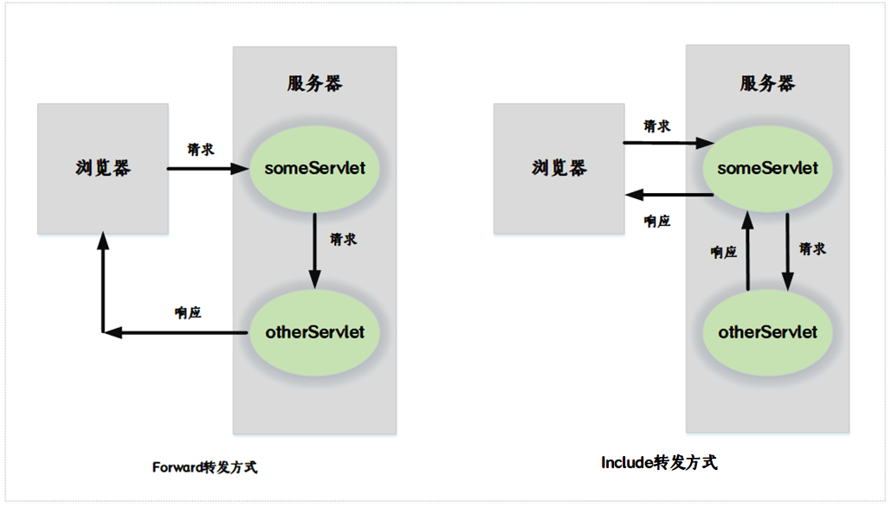

## IDEA搭建Servlet环境

[搭建教程](https://blog.csdn.net/wangxiaoan1234/article/details/76409210)

### Tomcat终端中文乱码问题

Tomcat终端乱码分两种情况

- cmd终端运行输出乱码：控制面板-时钟和区域-区域-管理-更改系统区域设置，勾选使用Unicode utf-8提供全球语言支持;

- IDEA终端乱码：[IDEA乱码](https://blog.csdn.net/nan_cheung/article/details/79337273);在VM options填写-Dfile.encoding=UTF-8

## Tomcat部署与解析

[Tomcat部署与配置解析](https://www.cnblogs.com/kismetv/p/7228274.html)
[相关视频](https://www.bilibili.com/video/av14548279)

## Servlet生命周期

1. 实例化：实例化一个HttpServlet实例，这个实例在运行时只有一个。
2. 初始化：Servlet 通过调用 init () 方法进行初始化，init()方法也只会调用一次。
3. 提供服务：Servlet 调用 service() 方法来处理客户端的请求。
4. 销毁：Servlet 通过调用 destroy() 方法终止（结束）。
5. 垃圾回收：最后，Servlet 是由 JVM 的垃圾回收器进行垃圾回收的。

## 使用 Servlet 读取表单数据

Servlet 处理表单数据，这些数据会根据不同的情况使用不同的方法自动解析：

- getParameter()：您可以调用 request.getParameter() 方法来获取表单参数的值。
- getParameterValues()：如果参数出现一次以上，则调用该方法，并返回多个值，例如复选框。
- getParameterNames()：如果您想要得到当前请求中的所有参数的完整列表，则调用该方法。

## HttpServletRequest请求参数

```HTML
<!DOCTYPE html>
<html lang="en">
<head>
    <meta charset="UTF-8">
    <title>用户注册</title>
    <style>
        #content{
            display: grid;
            grid-template-rows: auto;
            grid-template-columns: 100px 200px;
        }
        div{
            margin: 5px;
        }
    </style>

</head>
<body>
<form method="post" action="/register">
    <div id="content">
        <div><span>ID：</span></div>
        <div><input type="text" name="id"></div>
        <div><span>Password：</span></div>
        <div><input type="password" name="password"><br></div>
        <div><span>Hobby:</span></div>
        <div>
            <input type="checkbox" name="hobby" value="running">跑步
            <input type="checkbox" name="hobby" value="swimming">游泳
            <input type="checkbox" name="hobby" value="reading">读书
        </div>

        <div><button type="reset">Reset</button></div>
        <div><button type="submit">Register</button></div>
    </div>
</form>
</body>
</html>
```

```Java
import javax.servlet.ServletException;
import javax.servlet.annotation.WebServlet;
import javax.servlet.http.HttpServlet;
import javax.servlet.http.HttpServletRequest;
import javax.servlet.http.HttpServletResponse;
import java.io.IOException;
import java.util.Enumeration;
import java.util.Map;

@WebServlet(name = "registerServlet",urlPatterns = {"/register"})
public class registerServlet extends HttpServlet {
    protected void doPost(HttpServletRequest request, HttpServletResponse response) throws ServletException, IOException {
        request.setCharacterEncoding("utf-8");
        response.setContentType("text/html;charset=utf-8");
        /*
         * 1.request.getParameter("name")本质等同于request.getParameterValues("name")[0]
         * 2.可以参考request.getParameterValues("hobby")可知，只获取hobby的第一个值
         */
        // 接收指定参数值
        System.out.println("Parameter:");
        String id = request.getParameter("id");
        String password = request.getParameter("password");
        System.out.println("id:"+id);
        System.out.println("password:"+password);

        System.out.println("---------------");
        System.out.println("names:");
        // 接收所有参数值
        Enumeration<String> names = request.getParameterNames();
        // 遍历所有的值
        while (names.hasMoreElements()){
            String name = names.nextElement();
            String value = request.getParameter(name);
            System.out.println(name+" = "+value);
        }

        System.out.println("---------------");
        System.out.println("Values:");
        // 接收多个值
        String[] hobbys = request.getParameterValues("hobby");
        for (String value:hobbys){
            System.out.println(value);
        }

        // 获取Map
        System.out.println("---------------");
        System.out.println("Map:");
        Map<String,String[]> map = request.getParameterMap();
        for (String key:map.keySet()){
            System.out.println(key+"="+request.getParameter(key));
        }
    }
}
```

1. 请求参数是存放在Map中的
2. 这个Map的key为请求参数的名称，为String类型；这个Map的Value为请求参数的所有值，为String[]类型。
3. 使用最多的`request.getParameter("id")`等同于`request.getParameterValues("id")[0]`

注意tomcat的中文传输乱码问题，在低版本的Tomcat中，因为Tomcat底层使用的TCP协议使用的编码方式会导致中文传输会存在乱码，需要进行转换才能正确显示中文数据

```Java
    // 接收的是name，其字符编码是ISO8859-1
    String name = req.getParameter("name");
    // 打散：将name字符串按照源码进行打散
    byte[] bytes = name.getBytes("ISO8859-1");

    // 重新按照UTF-8进行存储
    name = new String(bytes,"UTF-8");
```

### 访问流程

1. 用户访问网站并填写数据，点击提交按钮；
2. 服务器根据`action="checkbox"`去web.xml中的`<url-pattern>`匹配相应的`<servlet-name>`，可以设置多个`<url-pattern>`，让多个地址映射到同一位置(记住action的值对应的是对应web.xml中<url-pattern>的，不是直接对应类名的)；
3. web.xml根据相应的`<serblet-name>`匹配相应的`<servlet-class>`，获取提供服务的文件地址；
4. 实例化一个CheckBox类开始服务，根据具体方法提供服务；

Servlet3.0[新的注解方式](https://www.jianshu.com/p/bdb83721210a),注意其中的`url-parttern>`可以写成`url={"/urlA","/urlB"}`来达到拦截多个url的效果;

## 文件上传

处理文件上传，在这之前我们先确保依赖包已经引入到项目的 WEB-INF/lib 目录下：

下面的实例依赖于 FileUpload，所以一定要确保在您的 classpath 中有最新版本的 commons-fileupload.x.x.jar 文件。可以从 http://commons.apache.org/proper/commons-fileupload/ 下载。

FileUpload 依赖于 Commons IO，所以一定要确保在您的 classpath 中有最新版本的 commons-io-x.x.jar 文件。可以从 http://commons.apache.org/proper/commons-io/ 下载。

[源码](Code\文件上传\upload.java)

**注意：所有需要依赖包的操作，比如SQL数据库访问，上面的文件上传，都需要先将jar包放入web-inf/lib下面才行**

## 域属性

域属性用于请求转发，用于不同的servlet服务进行通信

```Java
package ServletCommunicate;

import javax.servlet.ServletException;
import javax.servlet.annotation.WebServlet;
import javax.servlet.http.HttpServlet;
import javax.servlet.http.HttpServletRequest;
import javax.servlet.http.HttpServletResponse;
import java.io.IOException;

@WebServlet(name = "Servlet_A",urlPatterns = {"/servletA"})
public class Servlet_A extends HttpServlet {
    @Override
    protected void service(HttpServletRequest req, HttpServletResponse resp) throws ServletException, IOException {
        req.setCharacterEncoding("utf-8");
        resp.setContentType("text/html;charset=utf-8");

        // 设置域属性
        req.setAttribute("name","From Servlet_A");
        req.setAttribute("info","Servlet_A和Servlet_B通信");

        // 发送到servletB中
        req.getRequestDispatcher("/servletB").forward(req,resp);
    }
}
```

```Java
package ServletCommunicate;

import javax.servlet.ServletException;
import javax.servlet.annotation.WebServlet;
import javax.servlet.http.HttpServlet;
import javax.servlet.http.HttpServletRequest;
import javax.servlet.http.HttpServletResponse;
import java.io.IOException;
import java.util.Enumeration;

@WebServlet(name = "Servlet_B",urlPatterns = {"/servletB"})
public class Servlet_B extends HttpServlet {
    protected void service(HttpServletRequest request, HttpServletResponse response) throws ServletException, IOException {
        request.setCharacterEncoding("utf-8");
        response.setContentType("text/html;charset=utf-8");

    //    接收servletA的数据
        String name = (String) request.getAttribute("name");
        String info = (String) request.getAttribute("info");
        System.out.println("name:"+name);
        System.out.println("info:"+info);

        Enumeration<String> names = request.getAttributeNames();
        while (names.hasMoreElements()){
            String eleName = names.nextElement();
            System.out.println(request.getAttribute(eleName));
        }
    }
}
```

## 请求转发和重定向区别

通过HttpServletRequest获取到RequestDispatcher对象的forward()方法，可以实现请求转发的功能；而通过HttpServletResponse的sendRedirect()方法，则可以实现重定向功能。

请求转发和重定向有所区别。



请求转发，也成为服务器内部准发；重定向，也成为服务器外跳转。

重定向也可以利用get方式的特性进行数据传输，但是重定向也有编码问题，需要不同于请求转发的解决方式。

```Java
// 转发端
//需要发送的内容
String name = "中文";

// 进行编码
name = URLEncoder.encode(name,"UTF-8");
// 发送给otherservlet数据
response.sendRedirect("otherservlet/?name="+name);

// 接收端解码
String pname = request.getParameter("nam");
// 解码组装
pname = URLDecoder.decode(pname,"UTF-8");
pname = new String(pname.getBytes("ISO8859-1","UTF-8"));
```

重定向可以跳转到其他项目，但转发只能在当前项目进行转发。

### 区别：

(1) 请求转发

- 浏览器只发出一次请求，收到一次响应
- 请求所转发到的资源可以直接获取到请求中所携带的数据
- 浏览器地址栏显示为用户所提交的请求路径
- 只能跳转到当前应用的资源中

(2) 重定向
- 浏览器发出两次请求，接收到两次响应
- 重定向到资源不能直接获取到用户提交请求中所携带的数据
- 浏览器地址栏显示的为重定向的请求路径，而非用户提交请求的路径。也正因为如此，重定向的一个很重要作用是：**防止表单重复提交**
- 重定向不仅可以跳转到当前应用的其他资源，也可以跳转到其他应用中资源

### 重定向和请求转发的选择

- 如果需要跳转到其他应用，则使用重定向
- 如果是处理表单数据的servlet要跳转到其他servlet，则需要选择重定向。为了防止表单重复提交。
- 如果对某一请求进行处理的servlet的执行需要消耗大量的服务器资源（cpu、内存），此时这个servlet执行完毕后，也需要重定向。
- 其他情况，一般使用请求转发

### 请求转发的include方法和forword方法

```Java
package Forword_Include;

import javax.servlet.ServletException;
import javax.servlet.annotation.WebServlet;
import javax.servlet.http.HttpServlet;
import javax.servlet.http.HttpServletRequest;
import javax.servlet.http.HttpServletResponse;
import java.io.IOException;

@WebServlet(name = "someServlet",urlPatterns = {"/some"})
public class someServlet extends HttpServlet {
    protected void doGet(HttpServletRequest request, HttpServletResponse response) throws ServletException, IOException {
        System.out.println("request = "+request);
        System.out.println("response = "+response);

        request.getRequestDispatcher("other").forward(request,response);
    }
}
```

```Java
package Forword_Include;

import javax.servlet.ServletException;
import javax.servlet.annotation.WebServlet;
import javax.servlet.http.HttpServlet;
import javax.servlet.http.HttpServletRequest;
import javax.servlet.http.HttpServletResponse;
import java.io.IOException;

@WebServlet(name = "otherServlet",urlPatterns = {"/other"})
public class otherServlet extends HttpServlet {
    protected void doGet(HttpServletRequest request, HttpServletResponse response) throws ServletException, IOException {
        System.out.println("request = "+request);
        System.out.println("response = "+response);
    }
}
```

forword输出

```Java
request = org.apache.catalina.connector.RequestFacade@7a53556c
response = org.apache.catalina.connector.ResponseFacade@7494b456
request = org.apache.catalina.core.ApplicationHttpRequest@70ab3e1c
response = org.apache.catalina.connector.ResponseFacade@7494b456
```

include输出
```Java
request = org.apache.catalina.connector.RequestFacade@7c7894c4
response = org.apache.catalina.connector.ResponseFacade@326a4481
request = org.apache.catalina.core.ApplicationHttpRequest@4820e465
response = org.apache.catalina.core.ApplicationHttpResponse@4557f2b4
```

对于forward的请求转发，因为在资源1请求资源2的转发过程中也做过一次请求，这次请求包含了请求资源1的request，添加了额外的请求内容，增强了request请求。但forward请求转发不会增强response转发，因为此时response的流并没有开启。详细看下列

```Java
request.setCharacterEncoding("utf-8");
response.setContentType("text/html;charset=utf-8");

PrintWriter out = response.getWriter();

out.println("someServlet forward()之前");

//request.getRequestDispatcher("other").include(request,response);
request.getRequestDispatcher("other").forward(request,response);

out.println("someServlet forward()之后");
```

```Java
request.setCharacterEncoding("utf-8");
response.setContentType("text/html;charset=utf-8");

PrintWriter out = response.getWriter();
out.println("otherServlet forward()之后");
```

在上面的例子，浏览器访问localhost/some，浏览器并没有输出someServlet里的内容`someServlet forward()之前`，只输出了otherServlet里的内容。这就是因为forward里的response并没有得到增强。

而如果讲someServlet里的forward改成include，浏览器输出的则是`someServlet forward()之前 otherServlet forward()之后 someServlet forward()之后`，include把someServlet里的response内容一并转发给otherServlet了。



所以forward和include的区别主要表现在标准输出流开启时间的不同：

- forward():forward这个单词的意思是“向前”，说明当前的请求并未结束，需要继续“向前”，所以此时服务器并不会开启输出流，所以在使用forward()方法的servlet，其写入输出流的内容并不会发送到客户端浏览器中。对于客户端而言，response响应并不是使用forward()的servlet发出的，而是接收forward()的servlet发出的。所以也就会导致上面的情况，someServlet里的输出流内容丢失，并没有显示在浏览器中，只有otherServlet输出流的内容。

- include():include()这个单词则表示包含，说明当前的请求转发已经结束，其标准输出流已经打开，可以对客户端进行响应了，其不仅将自己的数据写入到标准输出流response，还要将其他数据包含在到自己的输出流中。所以对于客户端而言，响应是由包含include()方法的Servlet给出的。

所以，在使用forward()进行请求转发时，使用forward()的Servlet不应向Response中写入数据，如要写入数据，则应使用include()进行转发。


## 访问路径

### 访问路径的组成

URL，统一资源定位符，用于定位资源的一种方式。通常的URL资源访问路径由两部分组成：资源路径和资源名称。`http://localhost/index.html`，其中`http://localhost/`是资源路径，而`index.html`则是资源名称。资源路径和资源名称的划分一般看最后一个斜杠位置，在这个斜杠之前的内容为资源路径，在这之后的为资源名称。

根据资源路径能否可以完成资源的的准确定位的判断标准，可以将路径分为绝对路径和相对路径

### 绝对路径

绝对路径可以根据给出的路径可以准确的定位到资源的路径的。例如，快递单上的地址，快递员可以根据这个地址可以准确的把快递送到你手里。这就是绝对路径。

而对于计算机中的Web应用的绝对路径，则是指带访问协议的路径，即URL,例如`https://www.google.com`。

### 相对路径

相对路径，是指仅根据访问路径无法准确定位资源的路径。相对路径必须结合其参照路径才能够准确定位资源的绝对路径。参照路径的不同，所形成的绝对路径也将不同，定位的资源可能出现不同。所以`绝对路径 = 参照路径 + 相对路径`

浏览器或服务器会自动为不同的相对路径添加不同的参照路径，就像使用MarkDown文件里插入图片一样，给出的相对路径引用在PC上使用的绝对路径和上传到github上的绝对路径是不同的。

相对路径有两种写法：一种是一斜杠开头的，另一种是以路径名称开头的。根据相对路径的是否是以斜杠开头，且路径出现的文件的不同，其默认的参照路径是不同的。

#### 以斜杠开头的相对路径

以斜杠开头的相对路径，根据路径所在文件所处位置的不同，分为两种：前台路径和后台路径。

(1) 前台路径：所谓前台路径是指由浏览器解析执行的代码中所包含的路径。例如，html,css,js中的路径，以及JSP文件中的静态部分的路径（HTML标签中的路径）。例如，HTML以及jsp文件中的`、<a href=""></a>、<form action=""></form>`等标签中的路径；这些都属于前台路径。

**前台路径的参照路径是Web服务器的根路径**。即`http://127.0.0.1:8080`;

比如在一个Web项目下创建一个images文件夹，将web服务器启动，这个web项目名称是ServletWeb，HTML的引用如下

```HTML
<!DOCTYPE html>
<html lang="en">
<head>
    <meta charset="UTF-8">
    <title>相对路径</title>
</head>
<body>
    
</body>
</html>
```
这个img src="/images/view.jpg"，参照路径是`http://127.0.0.1:8080`,即表示在绝对路径是`http://127.0.0.1:8080/images/view.jpg`文件，表示images文件夹与Servlet同级，但实际上images文件夹是ServletWeb的子文件夹，是ServletWeb项目下的文件夹。所以如果需要正确显示这个文件则需要把src引用改成`image/view.jpg`或者`/ServletWeb/images/view.jpg`;

将前台路径转换为绝对路径的工作，是由浏览器自动完成的。该路径的作用是要为用户提交对某种资源的请求，是要查找并定位服务器中的某个资源，简单来说，前台路径的作用是"查找"。

(2) 后台路径：所谓后台路径是指由服务器解析执行的代码中所包含的路径。例如，Java代码中的路径、JSP文件动态部分(Java代码块)中的路径、XML等配置文件中的路径（配置文件是要被Java代码解析后加载到内存中，其中的路径会出现在Java代码中。**后台路径的参照路径是Web应用的根路径**。

后台路径的参照路径是Web应用的根路径。例如`http://127.0.0.1:8080/primary;`。

将后台路径转换为绝对路径的工作，是由服务器自动完成的。该路径的作用标识出资源在服务器的中的路径，以便客户端能够按照这个设定的路径来查找相应的资源。简单来说，后台路径的作用是"标识"。

#### 以路径名称开头的相对路径

以路径开头的相对路径，无论是出现前台页面，还是出现在后台Java代码或配置文件中，其参照路径都是当前访问路径的资源路径。即使是response的sendRedirect()方法的参数路径，若不以斜杠开头，其也属于“以路径名称开头的相对路径”累，参照路径为当前访问路径的资源路径。

#### 以response的sendRedirect()的重定向

以response的sendRedirect()的重定向，若其参数路径为“以斜杠开头的相对路径”。这个后台路径是个特例，之所以是个体例，是因为sendRedirect()方法的特性决定的，因为sendRedirect()方法不仅可以完成当前项目资源的跳转，还能够完成其他项目资源的跳转。所以这个后台路径的参照路径为“当前web服务器的根”；如果需要重定向到当前项目下的资源，最好写成`response.sendRedirect(request.getContextPath()+"/otherServlet")`;因为项目名称可能改变，而`request.getContextPath()`可以获取当前项目的根目录名称

#### 总结

相对路径类型|参照路径|相对路径转绝对路径的完成者
:---:|:---|:---:
前台路径|当前Web服务器的根路径，例如：http://127.0.0.1:8080|浏览器
后台路径|当前Web应用的根路径，例如：http://127.0.0.1:8080/primary|Web服务器
以路径名称开头的相对路径|当前访问路径的资源路径|浏览器/Web服务器

