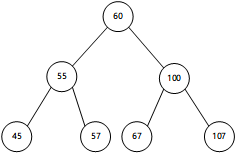
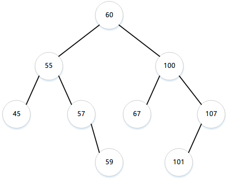

## 二叉树
### 基本概念



**路径长度：** 一条路径的长度指在该路径上边的个数。比如在60到45的长度为2；

**结点深度：** 一个结点的深度指从根节点到该结点的路径长度。结点60的深度是0，结点55的深度是1，结点45的深度是2。

**层：** 一棵树中具有某个给定深度的所有结点的集合称为该树的层。比如55，100同属于一层，45，57，67，107属于同一层。

**高度：** 非空树的高度是从根结点到最远叶结点的路径长度。习惯上，空树的高度为-1，只有一个结点的树的高度为0。

### 二叉查找树

二叉查找树是一种特殊的二叉树。二叉查找树特征：没有重复元素，对于树中的每一个结点，它的左子树中结点的值都小于该根结点的值，右子树中结点的值都大于根节点的值。


```java
// 树的定义
class TreeNode<E extends Comparable<E>> {
    protected E element;
    protected TreeNode<E> left;
    protected TreeNode<E> right;

    public TreeNode(E e){
        this.element = e;
    }

    // 查找元素
    public boolean search(E element){
        TreeNode<E> current = root;
        while (current != null){
            if (element.compareTo(current.element) < 0){
                current = current.left;
            }else if (element.compareTo(current.element) > 0){
                current = current.right;
            }else {
                return true;
            }
        }
        return false;
    }

    // 插入元素
    public boolean insert(E e){
        if(search(e)){
            // 结点已经存在
        }else {
            parent = current = root;
            while (current != null){
                // 元素小于当前结点，进入左子树
                if (e.compareTo(current.element) < 0){
                    parent = current;
                    current = current.left;
                }else if (e.compareTo(current.element) > 0){
                    parent = current;
                    current = current.left;
                }else {
                    return false;
                }
            }
            // 到末尾子结点，根据插入结点的大小考虑放在左节点还是右节点
            return true;
        }
    }
}
```
### 树的遍历

树的遍历就是访问树中每个结点且只有一次的过程。遍历树的方法有很多种，比如中序遍历（inorder)、前序（preorder）、后序（postorder）、深度优先（depth-frist）、广度优先（breadth-first）

**中序遍历**：首先递归地访问当前结点的左子树，然后访问当前结点，最后递归地访问该节点右子树。中序遍历以顺序显示BST(二叉查找树)中的所有结点。

**后序遍历**：首先递归的访问当前结点的左子树，然后递归的访问该结点的右子树，最后访问当前结点。

**前序遍历**：首先访问当前结点，然后递归的访问该结点的左子树，最后递归的访问该结点的右子树。
深度优先遍历法和前序遍历相同。

**广度优先遍历**：首先访问根节点，然后从左到右访问根节点的所有子节点，再从左到右访问子节点的所有子节点，以此类推。



该树的遍历结果：

中序遍历：45 55 57 59 60 67 100 107 101

后序遍历：45 59 57 55 67 101 107 100 60

前序遍历：60 55 45 57 59 100 67 107 101

广度优先：60 55 100 45 57 67 107 59 101
