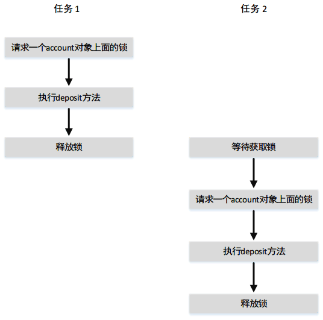

## 线程的概念

**一个程序可能包含多个可以同时运行的任务。线程是指一个任务从头至尾的执行流程。**

### 线程与进程的区别

进程：启动一个LOL.exe就叫一个进程。 接着又启动一个DOTA.exe，这叫两个进程。 
线程：线程是在进程内部同时做的事情，比如在LOL里，有很多事情要同时做，比如"盖伦” 击杀“提莫”，同时“赏金猎人”又在击杀“盲僧”，这就是由多线程来实现的。 
线程提供了运行一个任务的机制。对于Java而言，可以一个程序中并发地启动多个线程。这些线程可以再多处理器系统上同时运行。

在单处理器系统中，多个线程共享CPU的时间称为*时间分享*，而操作系统负责调度以及分配资源给它们。这种安排是可行的，因为CPU的大部分时间都是空闲的。


可以在程序中创建附加的线程以执行并发任务。在Java中，每个任务都是Runnable接口的一个实例，也可以称为*可运行对象（runnable object）*。线程本质上讲就是便于任务执行的对象。

**创建多线程有三种方法：继承线程类,实现Runnable接口,匿名类。**

- 继承线程类：在任务类中`taskThread`继承Thread线程类，在任务类中实现`run()`方法。然后在main()中创建任务类子类实例，然后`taskThread.start()`，有多少个线程创建多少任务子类，并start()运行;
- 实现Runnable接口：在任务类中实现Runnable接口，实现`run()`方法。最后在main()中创建任务，然后Thread线程实例，把用Thread线程启动任务类。`TaskClass task1 = new TaskClass();Thread thread1 = new Thread(task1);thread1.start();`有多少任务创建多少个任务实例，并创建同样多线程，一一start()运行。
- 匿名类：直接在main()中创建Thread实例，然后在`new Thread(){public void run(...)}`中重写run()方法，然后start()运行。匿名类的好处是可以很方便访问外部的局部变量。

## 创建任务和线程

**一个任务类必须实现Runnable接口。任务必须从线程运行。**

任务就是对象。为了创建任务，必须首先为任务定义一个实现Runnable接口的类。Runnable接口非常简单，它只包含一个Run方法。需要实现这个方法来告诉系统线程将如何运行。

**基本任务类模板**
```Java
// 任务类必须实现Runnable接口
public class TaskClass implements Runnable{
    ...
    public TaskClass(...){
    }

    // Runable方法必须实现run方法
    @Override
    public void run(){
        // 任务的具体运行内容
    }
}
```

```Java
public class Client{
    public void someMethod(){
        // 首先创建一个任务，但还没运行.
        TaskClass task = new TaskClass(...);

        // 新建一个线程，把任务放入这个线程，但还没运行
        // 任务必须在线程中执行。
        // Thread类包括创建线程的构造方法以及控制线程的很多有用的方法
        Thread thread = new Thread(task);

        // 运行线程
        thread.start();
    }
}
```
[多线程例子](../Code/TaskThreadDemo.java)

上面的程序创建了三个任务。为了同时运行它们，创建了三个线程。调用start()方法启动一个线程，它会导致任务中的run()方法被执行。当run()方法执行完毕，线程就终止了。

**注意**：*任务中的run()方法表明了如何完成这个任务。Java虚拟机会自动调用该方法，无需特意调用它。直接调用run()方法只是在同一个线程中执行该方法，而没有新的线程被启动。*

比如在上述程序，如果直接使用`thread1.run();thread2.run();thread3.run();`调用run()方法，只是在同一个线程中执行了run()方法，这个程序按代码执行顺序依次运行输出，做完thread1任务再做thread2、thread3。

## Thread类
Thread类包含为任务而创建的线程的构造方法，以及控制线程的方法。

```Java
public class CustomThread extends Thread{
    public CustomThread(...){
    }

    @Override
    public void run(){
        ...
    }
}

public class Client{
    public void someMethod(){
        // 这样把任务线程混合在一起可以不需要单独再写任务，直接创建Thread实列进行运行。
        CustomThread thread1 = new CustomThread(...);
        CustomThread thread2 = new CustomThread(...);
        thread1.start();
        thread2.start();
    }
}
```

**注意**：由于Thread类实现了Runnable，所以可以定义一个Thread的扩展类，并且实现run方法。然后在客服端程序中创建这个类的一个对象，并且调用它的start方法来启动进程。这可以不需要创建任务，然后再来Thread线程启动任务。

不过不推荐使用这种方法，因为它将任务和运行任务的机制混在一起了。将任务从线程中分离出来是比较好的设计。

**注意**：Thread类还包含stop()、suspend()和resume()。由于普遍认为这些方法具有内在的不安全因素，所以，在Java2中不提倡(或不流行)这些方法。为替代方法stop()的使用，可以通过给Thread变量复制null来表明它已经停止。

可以使用yield()方法为其他线程临时让出CPU时间。比如TaskThreadDemo程序中PrintNum类中的run()方法。
```Java
public void run(){
    for(int i = 1; i <= lastNum;i++){
        System.out.print(" "+i);
        Thread.yield();
    }
}
```
每次打印一个数字后，printNum任务的线程会让出时间给其他线程。

方法sleep(long mills)可以将该线程设置为休眠以确保其他线程的执行，休眠时间为指定的毫秒数。
```Java
public void run(){
    try{
        for(int i = 1; i <= lastNum;i++){
            System.out.print(" "+i);
            if (i >= 50){
                Thread.sleep(1);
            }
        }
    }catch (InterruptedException ex){
    }
}
```
当数字大于等于50时，printNum的任务线程每打印一个数字就休眠1毫秒。

sleep方法可能抛出一个InterruptedException，这是一个必检异常。当一个休眠线程interrupt()方法被调用时，就会发生这样的一个异常。这个interrupt()方法极少在线程上被调用，所以不太可能发生InterruptedException异常。但是，因为Java强制捕获必检的异常，所以，必须将它放到try-catch()块中。如果在一个循环中调用了sleep方法，那就应该将这个循环放在try-catch块中。

可以使用join()方法使另一个线程等待另一个线程的结束。主线程的概念：所有进程，至少会有一个线程即主线程，即main方法开始执行，就会有一个看不见的主线程存在。如果在一个线程中使用thread.join()，则表明thread加入了主线程，主线程会等待这个线程完成之后才会继续进行下面的线程任务

Java给每个线程指定一个优先级。默认情况下，线程继承生成它的线程的优先级。可以用setPriority方法提高或者降低线程的优先级，还能用getPriority获取线程的优先级。优先级时从1到10的数字。Thread类有int型常量MIN_PRIORITY、NORM_PRIORITY和MAX_PRIORITY，分别是1、5和10。主线程的优先级是Thread.NORM_PRIORITY。

Java虚拟机总是选择当前优先级最高的可运行线程。较低优先级的线程只有在没有比它更高优先级的线程时才能运行。如果所有可运行线程具有相同的优先级，那将会用循环队列给它们分配相同的CPU份额。这被称为*循环调度*。

**注意**：如果总有一个优先级较高的线程在运行，或者有一个相同优先级的线程不退出，那么这个线程可能永远也没有运行的机会。这种情况称为*资源竞争或缺乏*。为避免竞争现象，高优先级的线程必须定时地调用sleep方法或yield方法，来给低优先级或者相同优先级的线程一个运行的机会。

## 线程池

可以使用线程池来高效执行任务。

我们可以实现一个Runnable接口来定义一个任务类，以及创建一个线程来运行一个任务。

```Java
Runable task = new TaskClass(task);
new Thread(task).start();
```

该方法对单一任务的执行很方便，但是由于必须为每个任务创建一个线程，因此对大量任务而言不够高效。为每个任务开始一个新线程可能会限制吞吐量并且造成性能降低。

**线程池** 是管理并发执行任务个数的理想方法。Java提供了Executor接口来执行线程池中的任务，提供ExecutorService接口来管理和控制任务。ExecutorService是Executor的子接口。

[CountFib](../Code/CountFib.java)

[ExecutorDemo](../Code/ExecutorDemo.java)

为了创建一个Executor对象，可以使用Executors类中的静态方法。如上例所示。`newFixedThreadPool(int)`方法在池中创建固定数目的线程。

- 如果线程完成了任务的执行，它可以重新使用以执行另外一个任务。
- 如果线程池中所有的线程都不是处于空闲状态，而且有任务在等待执行，那么在关闭之前，如果由于一个错误终止了一个线程，就会创建一个新线程来替代它。
- 如果线程池中所有的线程都不是处于空闲状态，而且有任务在等待执行，那么`newCachedThreadPool()`方法就会创建一个新线程。
- 如果缓冲池中的线程在60秒内都没有被使用就该终止它。对许多小任务而言，一个缓冲池已经足够了。

在上面的例子中，如果把executorService中最大执行数目改成1，则这个三个可运行的任务将顺次执行，因为线程池中只有一个线程。

如果是`ExecutorService executorService = Executors.newCachedThreadPool();`，那将会为每一等待的任务创建一个新线程，所以，所有的任务都并发执行。

`newCachedThreadPool()`创建一个线程池，它会在必要的时候创建新的线程，但是如果之前创建的线程可用，则先重用之前创建的线程。

executorService.shutdown();通知执行器关闭。不能接受新的任务，但是现有的任务将继续执行直至完成。

*注意：* 如果急需要一个任务创建一个线程，就是用Thread类。如果需要为多个任务创建线程，最好使用线程池。

## 线程同步

线程同步用于协调相互依赖的线程的执行。

如果一个共享资源被多个线程同时访问，可能会遭到破坏。

[共享资源破坏例子](../Code/AccountWithoutSync.java)

上述例子的balance值并不是预期中的100,而是不确定的数。造成错误的情况：

|Step|Balance|Task 1|Task 2|
|:---:|:---:|:---:|:---:|
|1|0|newBalance = baance+1;||
|2|0||newBalance = baance+1;|
|3|1|balance = newBalance;||
|4|1||balance = newBalance;|

在步骤1、2中，任务1、2都从账户上获取了余额数目0进行+1。在步骤3、4中，任务1写入一个新余额，任务2也写入了一个新余额，导致覆盖了任务1所做的+1。

这种情景的效果相当于任务1什么也没做，因为在步骤4中，任务2覆盖了任务1的结果。这个问题的原因就是因为任务1和任务2会以一种引起冲突的方法访问一个公共资源。这是多线程程序中的一个普遍问题，这称为**竞争状态**,如果一个类的对象在多线程程序中没有导致竞争状态，则称这样的类为线程安全的。否则就是不是线程安全的。

### synchronized关键字
为避免竞争状态，应该防止多个线程同时进入程序的某一特定部分，程序中的这部分称为**临界区**。

上面资源共享破坏的例子中的临界区是整个deposit方法，可以使用关键synchronized来同步方法，以便一次只有一个线程可以访问这个方法。

有几种方法可以解决上述问题，一种方法是通过在deposit方法上添加关键synchronized，使Account类成为线程安全的。`public synchronized void deposit(double amout)`。

一个同步方法在执行之前需要加锁。*锁是一种实现资源排他使用的机制*。对于实例方法，要给调用该方法的对象加锁。对于静态方法，要给这个类加锁。如果一线程调用一个对象上的同步实例方法（静态方法），首先给该对象（类）加锁，然后执行该方法，最后解锁。在解锁之前，另一个调用那个对象（类）中方法的线程将被阻塞，知道解锁。



### 同步语句
调用一个对象上的同步实例方法，需要给该对象加锁。而调用一个类上的同步静态方法，需要给该类加锁。当执行方法中某一个代码块时，同步语句不仅可用于对this对象加锁，而且可用于对任何对象加锁。这个代码块称为同步块。同步语句的一般形式所示：
```Java
synchronized (expr){
    statements;
}
```
表达式expr求值结果必须是一个对象的引用。如果对象已经被另一个线程锁定，则在解锁之前，该线程将被阻塞。当获准对一个对象加锁时，该线程执行同步块中的语句，然后解除对象所加的锁。

同步语句允许设置同步方法中的部分代码，而不必时整个方法。这大大增强了程序的并发能力。上述例子的另一种实现线程安全的方式：
```Java
synchronized (account){
    account.deposit(1);
}
```

任何同步的实例方法都可以转换为同步语句。下面的同步实例方法是等价的。

```Java
public synchronized void xMethod(){
    // method body
}
```

```Java
public void xMethod(){
    synchronized (this){
        // method body
    }
}
```

## 利用加锁同步

可以显式地采用锁和状态来同步线程。

同步的实例方法在执行方法之前都隐式地需要一个加在实例上的锁。

Java可以显式地加锁，这给协调线程带来了更多的控制功能。一个锁是一个Lock接口的实例，它定义了加锁和释放锁的方法。锁也可以使用`newCondition()`方法来创建任意个数的Condition对象，用来进行线程通信。

ReentrantLock是Lock的一个具体实现，用来创建相互排斥的锁。可以创建具有特定的公平策略的锁。公平策略为真，则确保等待时间最长的线程首先获得锁。取值为假的策略给任意一个等待的线程。被多个线程访问的公正锁的程序，其整体性能可能比那些使用默认设置的程序差，但是在获取且避免资源缺乏时可以有更小的时间变化。
```Java
public static class Account{
    private static Lock lock = new ReentrantLock();
    private int balance = 0;

    public int getBalance(){
        return balance;
    }

    public void deposit(int amount){
        // 上锁
        lock.lock();
        try{
            int newBalnce = balance + amount;
            Thread.sleep(5);
            balance = newBalance;
        }catch(InterruptedException ex){
            ex.printStackTrace();
        }finally{
            // 释放锁
            lokc.unlock();
        }
    }
}
```
通常使用synchronized方法或语句比使用相互排斥的显式锁简单些。然而，使用显式锁对同步具有状态的线程更加的直观和灵活。

## 线程间协作
锁上的条件可以用于协调线程之间的交互。

通过保证在临界区上多个线程的相互排斥，线程同步完全可以避免竞争条件的发生，但是有时候还需要线程之间的相互协作。可以使用条件实现线程间的通信。一个线程可以指定在某种条件下该做什么。条件是通过调用Lock对象的newCondition()方法而创建的对象。一旦创建了条件，就可以使用await()，signal()和signalAll()方法来实现线程之间的相互通信。await()方法可以让当前线程进入等待，知道条件发生。signal()方法唤醒一个等待的线程，而signalAll()唤醒所有等待的线程。

[存取款问题](../Code/LockCondition/ThreadCoopration.java)

**一旦线程调用条件上的await()，线程就进入等待状态，等待恢复的信号。如果忘记对状态调用signal()或者signalAll()。那么线程就永远等待下去。**

**条件有Lock对象创建。为了调用它的方法（例如，await()、signal()和signalAll()），必须首先拥有锁。如果没有获取锁就条用这些方法，会抛出IllegalMonitorException异常。**

[生产消费者模型](../Code/ConsumerProduerModel/ConsumerProducer.java)

## 阻塞队列
Java合集框架提供了ArrayBlockingQueue、LinkedBlockingQueue和PriorityBlockQueue来支持阻塞队列。

阻塞队列（blocking queue）在试图向一个满队列添加元素或者从空队列中删除元素时会导致线程阻塞。BlockingQueue接口继承了java.util.Queue，并且提供同步的put和take方法向队列尾部添加元素，以及从队列头部删除元素。

Java支持的三个具体阻塞队列ArrayBlockingQueue、LinkedBlockingQueue和PriorityBlockQueue都在java.util.concurrent包中。

ArrayBlockingQueue使用数组实现阻塞队列，必须指定一个容量或者可选的公平性策略来构造ArrayBlockingQueue。

LinkedBlockingQueue使用列表实现阻塞队列，可以创建无边界的或者有边界的LinkedBlockingQueue。

PriorityBlockingQueue是优先队列，可以创建无边界或者有边界的优先队列。

**对于无边界的LinkedBlockingQueue或PriorityBlockingQueue而言，put方法将永远不会阻塞。**

## 信号量

**可以使用信号量来限制访问一个共享资源的线程数。**

计算机科学中，信号量指对共同资源进行访问控制的对象。在访问资源之前，线程必须从信号量获取许可，在访问完资源之后，这个线程必须将许可返回给信号量。

为了创建信号量，必须确定许可的数量，同时可选用公平策略。任务通过调用信号量的acquire()方法来获得许可，通过调用信号量的release()方法来释放许可。一旦获得许可，信号量中可用许可的总数减1。一旦许可被释放，信号量中可用许可的总数加1。

只有一个许可的信号量可以用来模拟一个相互排斥的锁。

```Java
// 重写Account，利用许可模拟互斥锁
public class Account{
    private static Semaphore semaphore = new Semaphore(1);
    private int blance = 0;

    public int getBlance(){
        return balance;
    }

    public void deposit(int amount){
        try {
            // 获取许可
            semaphore.acquire();
            int newBalance = balance + amount;
            Thread.sleep(5);
            balance = newBalance;
        }catch (InterruptedException ex){
            ex.printStackTrace();
        }finally {
            // 释放许可
            semaphore.release();
        }
    }
}

```

## 避免死锁

可以采用正确的资源排序来避免死锁。

有两个或多个线程需要在几个共享对象上获取锁，这可能会导致死锁。也就是说，每个线程以及获取了其中一个对象上的锁，而且正在等待另一对象上的锁。考虑两个线程和两个对象的情形。比如线程1获取object1的锁，线程2获取object2的锁。每个线程都在等待另一个线程释放它所需要的锁，结果导致两个线程都无法继续运行。

使用一种称为资源排序的简单基数可以轻易地避免死锁的发生。该技术是给每一个需要锁的对象指定一个顺序，确保每个线程都按这个顺序来获取锁。

## Lock和synchronized的区别
1. Lock是一个接口，而synchronized是Java中的关键字，synchronized是内置的语言实现，Lock是代码层面的实现。

2. Lock可以选择性的获取锁，如果一段时间获取不到，可以放弃。synchronized不行，会一根筋一直获取下去。 借助Lock的这个特性，就能够规避死锁，synchronized必须通过谨慎和良好的设计，才能减少死锁的发生。

3. synchronized在发生异常和同步块结束的时候，会自动释放锁。而Lock必须手动释放， 所以如果忘记了释放锁，一样会造成死锁。

## 线程状态

线程状态可以表明一个线程的状态。任务在线程中执行。线程状态可以是：新建、就绪、运行、阻塞或结束5种状态。

新创建一个线程时，它就进入新建状态（New)。调用线程的start()方法启动线程后，它进入就绪状态(Ready)。就绪线程是可运行的，但可能还没有开始运行。操作系统必须为它分配CPU时间。

就绪线程开始运行时，它就进入运行状态。如果给定CPU时间用完或调用线程的yield()方法，处于运行状态的线程可能就进入就绪状态。


有几种原因可能使线程进入阻塞状态（即非活动状态）。可能是它自己调用了join()、sleep()或wait()方法。它可能是在等待I/O操作的完成。当使得其处于非激活状态的动作不起作用时，阻塞线程可能被重新激活。例如，如果线程处于休眠状态并且休眠时间已过期，线程就会重新激活进入就绪状态。

最后，如果一个线程执行完它的run()方法，这个线程就被结束(finished)。

isAlive()方法是用来判断线程状态的方法。如果这个线程处于就绪、阻塞或运行状态，则返回true；如果线程处于新建并且没有启动的状态，或者已经结束，则返回false。

方法interrupt()按下列方式中断一个线程：当线程处于就绪或运行状态时，给它设置一个中断标志；当线程处于注射状态时，它被唤醒并进入就绪状态，同时抛出异常java.lang.interruptedException。

## 同步合集
*Java合集框架为线型表、集合和映射表。*

Java合集框架中的类不是线程安全的；也就是说，如果它们被同时多个线程访问和更新，它们的内容可能被破坏。可以通过锁定合集或者同步合集来保护合集中的数据。

Collections类提供6个静态方法来将合集转成同步版本。synchronizedCollection、synchronizedList、synchronizedMap、synchronizedSet、synchronizedSortedMap、synchronizedSortedSet。

这些同步包装类是线程安全的，但是迭代器具有快速失效的特性。这就意味着当使用一个迭代器对一个合集进行遍历，而其依赖的合集被另一个线程修改时，那么迭代器会抛出异常java.util.ConcurrentModificationException报错，该异常是RuntimeException的一个子类。为了避免这个错误，需要创建一个同步合集对象，并且在遍历它时获取对象上的锁。
```Java
Set hashSet = Collections.synchronizedSet(new HashSet());
synchronized (hashSet){
    Iterator iterator = hashSet.iterator();
    while (iterator.hasNext()){
        System.out.println(iterator.next());
    }
}
```
不这样做会造成不确定的行为，比如ConcurrentModificationException。

## 并行编程
Fork/Join框架用于在Java中实现并行编程。

多核系统的广泛应用产生了软件的革面。为了从多核系统受益，软件需要可以并行运行。JDK7引入了新的Fork/Join框架拥有并行编程，从而利用多核处理器。


一个问题分为不重叠的子问题，这些子问题可以并行地独立解决。然后合并所有子问题的解答获得问题的整体解答。这是分而治之方法的实现。JDK7的Fork/Join框架中，一个分解（Fork）可以视为运行在一个线程上的独立任务。 

ForkJoinTask是用于任务的抽象基类。一个ForkJoinTask是一个类似线程的实体，但是比普通的线程要轻量级得多，因为巨量的任务和子任务可以被ForkJoinPool中的少数真正的线程执行。任务主要使用fork()和join()来协调。在一个任务上调用fork()会安排异步的执行，然后调用join()等待任务完成。invoke()和invokeAll(tasks)方法隐式地调用fork()来执行任务，以及join()等待任务的完成，如果有结果则返回结果。注意，静态方法使用invokeAll使用...可变参数语法来采用一个变长度的ForkJoinTask参数。

RecursiveAction和RecursiveTask是ForkJoinTask的两个子类。要定义具体的任务类，类应该继承RecursiveAction或者RecursiveTask。RecursiveAction用于不返回值的任务，而RecursiveTask用于返回值的任务。你自己的任务类应该重写compute()方法来指定任务是如何执行的。

[利用并行编程进行排序](../Code/ParallelMergeSort.java)

[并行编程寻找最大值](../Code/ParallelMax.java)