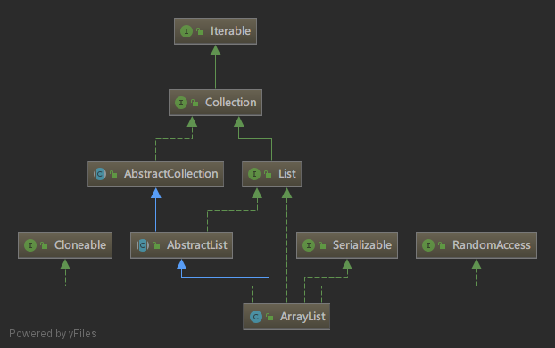
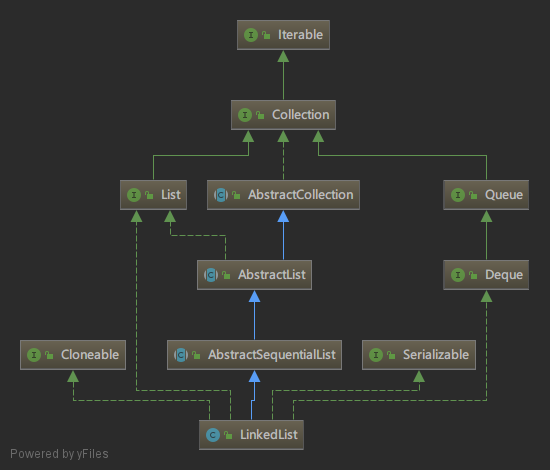
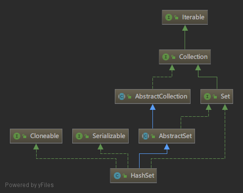
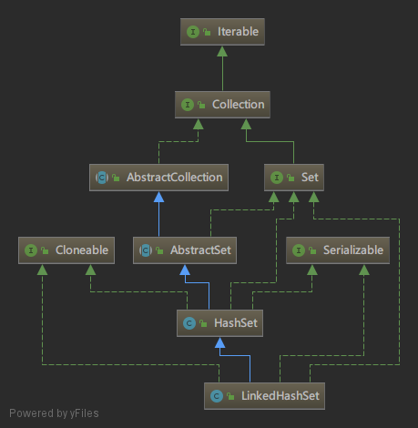
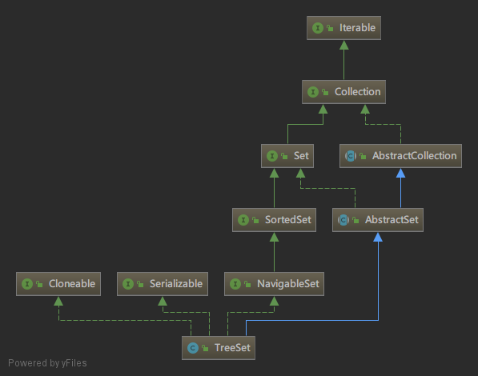

## 基本概念
Java容器类类库的用途是“保存对象”，并将其划分为两个不同的概念

- *Collection*。合集，一个独立元素的序列。这些元素都服从一条或多条规则。List必须按照插入顺序保存元素。而Set不能有重复元素。Queue按照排队规则来确定对象产生的顺序（通常与它们的被插入的顺序相同）。

- *Set*。集合，一个用于存储和处理无重复元素的数据结构。

- *Map*。映射表，一组成对的“键值对”对象，允许你使用键来查找值。ArrayList允许你使用数据来查找值，某种意义上讲，它将数字与对象关联在一起。映射表允许我们使用另一个对象来查找某个对象，它也被称为“关联数组”，因为它将某些对象与另外一些对象关联在一起；或者被称为“字典”，因为你可以使用键对象来查找对象，就像在字典中使用单词来定义一样。

## List
List是Collection的子类，List接口在Collection的基础上添加了大量的方法，使得可以在List的中间插入和删除元素





List的类型：
- *ArrayList*，因为通过下标索引存储，所以查找访问的效率高，但是插入或者删除元素速度慢。

- *LinkedList*，随机访问效率低，但是因为采用链式存储方法，插入和删除元素效率速度快。

## 迭代器 
迭代器是一个对象，它的工作是遍历并选择序列中的对象，而客服端程序员不必知道或者关心该序列底层的结构。

Java的Iterator只能单向移动，这个Iterator只能用来
1. 使用方法`iterator()`要求容器返回一个Iterator。Iterator将准备好返回序列的第一个元素。
2. 使用`next()`获得序列的下一个元素。
3. 使用`hasNext()`检查序列中是否还有元素。
4. 使用`remove()`将迭代器新近的返回的元素删除。

## Set集合
set用于存储不重复的数据。有HashSet、LinkedHashSet、TreeSet。Set接口扩展了Collection接口。

### HashSet



HashSet类是一个实现了Set接口的具体类，可以使用它的无参构造方法来创建空的散列集，也可以由一个现有的合计创建散列集。其内部元素是无须的。

HashSet类可以用来存储互不相同的任何元素。考虑到效率的因素，添加到散列集中的对象必须以一种正确分散散列码的方法来实现hashCode方法。如果两个对象相等，那么这两个对象的散列码必须不一样。两个不相等的对象可能会有相同的散列码，因此你应该实现hashCode方法以避免出现太多这样的情况。

### LinkedHashSet



LinkedHashSet用一个链表实现来扩展HashSet类，属于HashSet的子类，可以按照元素的插入顺序进行排序。

### TreeSet



TreeSet可以按照某种规则顺序存储对象，只要对象是可以互相比较的，实现Comparable接口或者Comparator接口，那么就可以使用TreeSet存储。

```Java
// 基本形式
Set<String> hashSet = new HashSet<>();

Set<String> linkedHashSet = new LinkedHashSet<>();

Set<ComparableObject> treeSet = new TreeSet<>();
```

```Java
// 各种数据结构的查找和删除元素的效率对比
package Chapter21;

import java.util.*;

public class SetListPerformanceTest {
    private static int N = 50000;

    public static void main(String[] args) {
        List<Integer> list = new ArrayList<>();
        for (int i = 0; i < N ;i++){
            list.add(i);
        }
        Collections.shuffle(list);

        // HashSet
        Collection<Integer> hashSet = new HashSet<>(list);
        System.out.println("hashSet查找元素消耗时间："+getTestTime(hashSet));
        System.out.println("hashSet移除元素消耗时间："+getMoveTime(hashSet));

        //LinkedHashSet
        Collection<Integer> linkedHashSet = new LinkedHashSet<>(list);
        System.out.println("linkedHashSet查找元素消耗时间："+getTestTime(linkedHashSet));
        System.out.println("linkedHashSet移除元素消耗时间："+getMoveTime(linkedHashSet));

        //TreeSet
        Collection<Integer> treeSet = new TreeSet<>(list);
        System.out.println("treeSet查找元素消耗时间："+getTestTime(treeSet));
        System.out.println("treeSet移除元素消耗时间："+getMoveTime(treeSet));

        //ArrayList
        Collection<Integer> arrayList = new ArrayList<>(list);
        System.out.println("arrayList查找元素消耗时间："+getTestTime(arrayList));
        System.out.println("arrayList移除元素消耗时间："+getMoveTime(arrayList));

        //LinkedList
        Collection<Integer> linkedList = new LinkedList<>(list);
        System.out.println("linkedList查找元素消耗时间："+getTestTime(linkedList));
        System.out.println("linkedList移除元素消耗时间："+getMoveTime(linkedList));

    }

    private static long getTestTime(Collection<Integer> collection){
        long startTime = System.currentTimeMillis();
        for (int i = 0 ; i < N ; i++){
            collection.contains((int)(Math.random()*2*N));
        }
        return System.currentTimeMillis() - startTime;
    }

    private static long getMoveTime(Collection<Integer> collection){
        long startTime = System.currentTimeMillis();
        for (int i = 0; i < N ;i++){
            collection.remove(i);
        }
        return System.currentTimeMillis()-startTime;
    }
}

```

## 映射表
映射表(map)是一种依照键/值对存储元素的容器。它提供了通过键快速获取、删除和更新键/值对的功能。映射表将值和键一起保存。可以使用三个具体的类来创建一个映射表：散列映射表HashMap、链式散列映射表LinkedHashMap、树形映射表TreeMap。

HashMap对于定位一个值、插入一个条目以及删除一个条目而言，HashMap类是高效的。HashMap没有顺序。

LinkedHashMap类使用链表来扩展HashMap类，它支持映射表中条目排序。LinkedHashMap中，元素既可以按照它们插入映射表的顺序排序(称为插入顺序)，也可以按照它们被最后一次访问时的顺序排序，从最早到最晚(称为访问顺序)排序。

TreeMap类在遍历排好顺序的键是很高效的。键可以使用Comparable接口或者Comparator接口来排序。

Map遍历需要使用entrySet()方法来返回一个包含映射表中条目的集合进行遍历。形式

```Java
package Chapter21;

import java.util.*;

public class TestMap {
    public static void main(String[] args) {

        // HashMap
        Map<String,Integer> hashMap = new HashMap<>();
        hashMap.put("Smith",30);
        hashMap.put("Anderson",31);
        hashMap.put("Lewis",28);
        hashMap.put("Cook",28);
        System.out.println("Display entries in HashMap:");
        System.out.println(hashMap);

        // TreeMap
        Map<String,Integer> treeMap = new TreeMap<>(hashMap);
        System.out.println("Display entries in TreeMap:");
        System.out.println(treeMap);

        // LinkedHashMap
        Map<String,Integer> linkedHashMap = new LinkedHashMap<>();
        linkedHashMap.put("Smith",30);
        linkedHashMap.put("Anderson",31);
        linkedHashMap.put("Lewis",28);
        linkedHashMap.put("Cook",28);
        System.out.println("Display entries in LinkedHashMap:");
        System.out.println(linkedHashMap);

        // entrySet()
        Set<Map.Entry<String,Integer>> entrySet = linkedHashMap.entrySet();
        for (Map.Entry<String,Integer> entry: entrySet){
            System.out.println(entry.getKey()+" : "+entry.getValue());
        }
    }
}

```