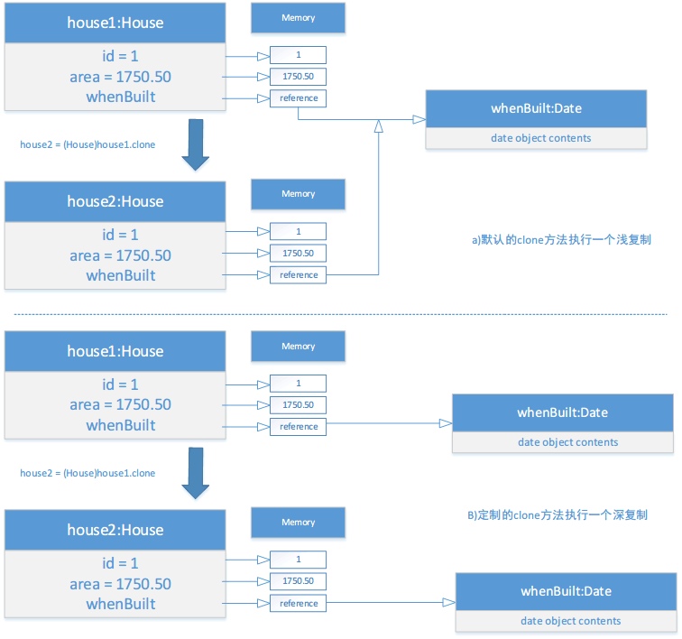

## 抽象类
*抽象类*：抽象类不可以实例化成对象（只有定义而没有实现）。抽象类可以包含抽象方法，这些方法将在具体的子类中实现。抽象类的构造方法定义为`protected`,因为抽象类只能被子类使用。

*抽象类注意点*：
- 抽象方法不能包含在非抽象类中。如果抽象类的子类不能实现抽象父类的所有方法，那么子类也必须被定义为抽象类。抽象方法是非静态的。
- 抽象方法只有定义而没有实现。它的实现由子类提供。抽象父类的抽象方法，其子类必须实现。
- 抽象类是不能用`new`操作符来初始化。但是抽象类仍然可以有它的构造方法，这个构造方法可以在它的子类构造方法中调用。
- 包含抽象方法的类必须是抽象的。但是，抽象类可以不包含抽象方法。
- 子类可以覆盖父类的方法并将它定义为`abstract`。虽然很少见，但是它在当父类的方法实现在子类中变得无效时很有用。
- 即使子类是具体的，这个子类也可以是抽象的。比如，`Object`是具体的，但是它的子类却可以是抽象的。
- 不能用`new`操作符从一个抽象类创建一个实例。但是可以将抽象类当作一种数据类型。比如`GeometricObject`是一个抽象类，`Circle`和`Rectangle`是这个抽象类的子类。`GeometricObject[] objects = new GeometricObject[10];`这样的操作是可以正常运行的，我们可以用`objects[0] = new Circle()`赋值。

## 接口
*接口*：接口是一种与类相似的结构，*只包含常量和抽象方法*。接口与类很多方法相似，但是它的目的是指明相关或者不相关类的多个对象的共同行为。

对于抽象类`implements`实现接口，抽象父类可以只声明实现这个抽象类而不在当前抽象类具体实现这个类，而它的非抽象子类则必须具体去实现这个接口。

## 接口与抽象类的
*一个类可以实现多个接口，但是只能继承一个父类*

|       |    变量    |  构造方法   |    方法    |
|   --- |   ---      |  ---       |     ---    |
|抽象类|无限制|子类通过构造方法链调用构造方法，抽象类不能用new操作符实例化|无限制|
|接口|所有变量必须是public static final|没有构造方法。接口不能用new操作符实例化|所有方法必须是公共的抽象实例方法|

Java只允许为类的扩展做单一继承，但是允许使用接口做多重扩展。
```Java
public class newClass extends BaseClass implements Interface1,...,InterfaceN{
    ...
}
```
利用关键字extends，接口可以继承其他接口。这样的接口称为子接口。
```Java
public interface newInterface extends Interface1,...,InterfaceN{
    ...
}
```

## Cloneable接口
Cloneable接口给出了一个克隆的对象。
常见的接口包含常量和抽象方法，但是cloneable接口是一个特殊情况。在`java.lang`包中的Cloneable接口的定义如下：
```java
package java.lang;
public interface Cloneable{
}
```
Cloneable接口是空的，一个带空的接口成为*标记接口*。一个标记接口既不包含常量也不包含方法。它用来表示一个类拥有某些特定的属性。实现Cloneable接口的类标记位可克隆的，而且它的对象可以使用在Object类中定义的clone()方法克隆。

## 浅复制和深复制
```Java
import java.util.Date;

public class House implements Cloneable,Comparable<House>{
    private int id;
    private double area;
    private Date whenBuilt;

    public House(int id, double area, Date whenBuilt) {
        this.id = id;
        this.area = area;
        whenBuilt = new Date();
    }

    public int getId() {
        return id;
    }

    public double getArea() {
        return area;
    }

    public Date getWhenBuilt() {
        return whenBuilt;
    }

    @Override
    public Object clone() throws CloneNotSupportedException {
        return super.clone();
    }

    @Override
    public int compareTo(House o){
        if (area > o.area){
            return 1;
        }else if (area < o.area){
            return -1;
        }else
            return 0;
    }
}
```
现在，可以创建一个House类的对象，然后从这个对象创建一个完全一样的拷贝
```java
House house1 = new House(1,1750.50);
House house2 = (House)house1.clone();
```
house1和house2是两个内容相同的不同对象。Object类中的clone方法将原始对象的每个数据域赋值给目标对象。

如果一个数据域是基本类型，复制的就是它的值。例如`area,id`的值是从house1复制到house2。

如果一个数据域是对象，复制的就是该域的引用。比如`whenBuilt`是Date类，所以，它的引用被复制给house2。即使`house1==house2`为假，但是`house1.whenBuilt == house2.whenBuit`为真。这称为浅复制（shallow copy)而不是(deep copy),这意味着如果数据域是对象类型，那么复制的是对象的引用，而不是它的内容。

*注意*：深复制只是创建一个新的引用对象，原本引用的对象所引用的值还是一样的。比如`house1`和`house2`的`whenBuilt`的值还是一样的，但是却不是同一个对象。



如果希望House对象执行深复制，将`clone()`进行修改
```Java
import java.util.Date;

public class House implements Cloneable,Comparable<House>{
    private int id;
    private double area;
    private Date whenBuilt;

    public House(int id, double area) {
        this.id = id;
        this.area = area;
        whenBuilt = new Date();
    }

    public int getId() {
        return id;
    }

    public double getArea() {
        return area;
    }

    public Date getWhenBuilt() {
        return whenBuilt;
    }

    //浅复制方式
    //@Override
    //public Object clone() throws CloneNotSupportedException {
    //    return super.clone();
    //}

    //深复制方式
    @Override
    protected Object clone() throws CloneNotSupportedException {
        House houseClone = (House) super.clone();
        houseClone.whenBuilt = (Date)(whenBuilt.clone());
        return houseClone;
    }

    @Override
    public int compareTo(House o){
        if (area > o.area){
            return 1;
        }else if (area < o.area){
            return -1;
        }else
            return 0;
    }
}

```

## 抽象和接口的使用对比

通常，推荐使用接口而非抽象类，因为接口可以定义位非相关类共有的夫类型。接口比类更加的灵活。

参考《Java语言程序设计》13.8 接口与抽象类。

对于一个抽象类中定义的抽象方法,必须是它的子类才能重写使用这个抽象方法。而对于接口而言，两个互不相关的类只要实现了这个接口，就可以把这个接口当作父类型，从而直接使用接口的方法，而不用考虑这些类到底属于那种类型。