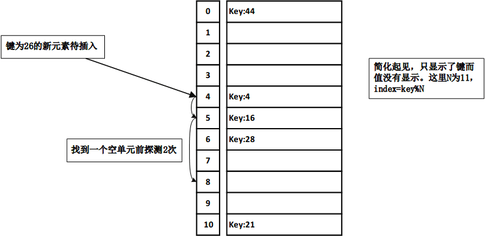
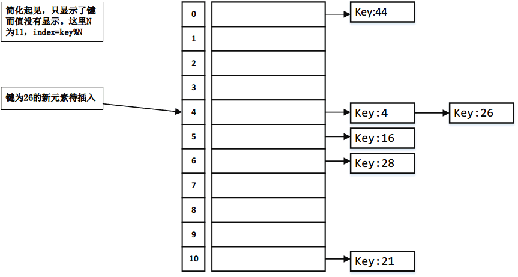

## 散列
散列非常高效。使用散列实现一个映射表或者集合，从而在O(1)时间内来查找、插入以及删除一个元素。

散列使用一个散列函数，将一个键映射到一个索引上。

映射表(map)又称为字典(dictionary)、散列表(hash table)或者关联数组(associate array)。

## 散列函数和散列码
典型的散列函数首先将搜索键转换成一个称为散列码的整数值，然后将散列码压缩为散列表中的索引。

Java的根类Object具有hashCode方法，该方法返回一个整数的散列码。默认的，方法返回一个该对象的内存地址。

hashCode方法的一般约定如下：

- 当equals方法被重写时，应该重写hashCode方法，从而保证两个相等的对象返回同样的散列码。
- 程序执行中，如果对象的数据没有被修改，则多次调用hashCode将返回同样的整数。
- 两个不相等的对象可能具有同样的散列码，但是应该在实现方法时避免太多这样的情形出现。

### 基本数据类型的散列码

对于byte、short、int以及char类型的搜索键而言，简单地将他们转型为int。

对于float类型的搜索键，使用Float.floatToIntBits(key)作为散列码。注意，floatToIntBits(float f)返回一个int值，该值的比特表示和浮点数f的比特表示相同。

对于long类型的搜索键，简单地将其类型转换成为int将不是很好的选择，因为所有前32比特不同的键将具有相同的散列码。考虑到前32比特，将64比特分为两部分，并执行异或操作将部分结合。这个过程称为折叠。

### 字符串类型的散列码
用String类字符串作为键很常见，字符串直观的方法是将所有字符的Unicode求和作为字符串的散列码，但是如果遇到同样字母的字符串，将产生许多冲突，例如dot和tod。一个更好的办法是考虑字符串的位置，然后产生散列码。多项式散列码：

$$S_{0}×b^{n-1}+S_{1}×b^{n-2}+...+S_{n-1}$$

这里的Si为s.charAt(i)。这个计算对于长的字符串来说，会导致溢出，但是Java中会忽略算术溢出。应该选择一个合适的b值来最小化冲突。实验显示，b较好的取值为31，33，37，39，和41。String类中，hashCode采用b值为31的多项散列码计算被重写。

### 使用开放地址法处理冲突

#### 线性探测
当插入一个条目到散列表中发生冲突时，线性探测法按顺序找到下一个可用的位置。例如，如果冲突发生在hashTable[k%N]，则检查hashTable[(k+1)%N]是否可用。如果不可用，则检查hashTable[(k+2)%N]，一次类推，直到一个可用单元被找到。

#### 二次探测
二次探测法可以避免线性探测法产生的成簇的问题。线性探测法从索引k位置审查连续单元。二次探测法则从索引为(k+j^2)%N位置的单元开始审查，其中j≥0。即k%N，(k+1)%N，(k+4)%N,(k+9)%N,以此类推。

#### 再哈希法
从初始索引k开始，线性探测法和二次探测法都对k增加了一个值定义一个搜索序列。对于线性探测法来说增量为1，对于二次探测法来说增量为j^2。这些增量都独立于键。在哈希法在键上应用一个二次散列函数h`(key)来确定增量，从而避免成簇的问题。

具体来说，再哈希审查索引为(k+j*h\`(key))%N处的单元，其中j≥0，即k%N,(k+h\`(key))%N,(k+2*h\`(key))%N，以此类推

### 使用链地址法处理冲突

链地址法将具有同样的散列索引的条目都放在一个位置，而不是寻找一个新的位置。链地址法的每个位置使用一个桶来放置多个条目。可以使用数组，ArrayList或者LinkedList来实现一个桶。这里使用LinkedList演示。

