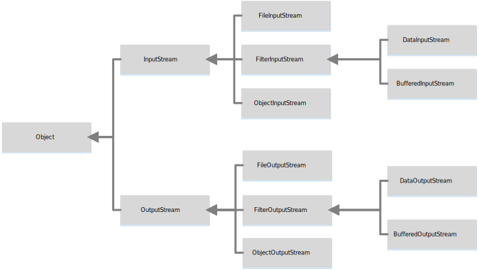

## 文件分类
文件可以分类为文本或者二进制的。可以使用文本编辑器，比如Windows下的记事本或者UNIX下的vi编辑器，进行处理(读取、创建或者修改)的文件称为文本文件。所有其他的文件称为二进制文件。不能使用文本编辑器来读取二进制文件，它们是为让程序来读取而设计的。

Java提供了许多实现文件输入/输出的类。这些类可以分为文本I/O类（text I/O class)和二进制I/O(binary I/O class)。

文本I/O类是由字符序列构成的，而二进制文件是由位（bit)序列构成的。比如，十进制整数199在文本文件中是以三个字符序列'1'，'9'，'9'构成的。而在二进制文件中它是以字节类型的值C7存储。
## File类
File类包含了获得一个文件/目录的属性，以及对文件/目录进行改名和删除的方法。File不包含读写文件内容的方法。
```Java
import java.io.File;
import java.util.Date;

public class TestFile{
    public static void main(String[] args) {
        File file = new File("C:/User/Cube/Downloads");

        // 常见File类操作
        System.out.println("文件是否存在："+file.exists());
        System.out.println("文件能否读写："+file.canRead()+file.canWrite());
        System.out.println("目标是目录："+file.isDirectory());
        System.out.println("目标是文件："+file.isFile());
        System.out.println("获取文件名："+file.getName());
        System.out.println("获取完整地址："+file.getPath());
        System.out.println("获取父目录："+file.getParent());
        System.out.println("获取文件最后修改时间"+new Date(file.lastModified()));
        System.out.println("获取文件大小："+file.length());
        System.out.println("删除文件用file.delete(),重命名用file.reNameTo(dest:File)");
        System.out.println("创建文件目录：file.mkdir(),如果父目录不存在用file.mkdirs()");
    }
}
```

## 文件输入和输出

### PrintWriter写数据
`java.io.PrintWriter`类可用来创建一个文件并向文本文件写入数据。
```Java 
PrintWriter output = new PrintWriter(filename);
```

```Java
import java.io.File;
import java.io.FileNotFoundException;
import java.io.IOException;
import java.io.PrintWriter;

public class TestPrintWrite {
    public static void main(String[] args) {
        File file = new File("File/test.txt");
        file.getParentFile().mkdirs();
        try (PrintWriter output = new PrintWriter(file);){
            output.println("from PrintWriter Data");
            output.println("just test");
            output.print("Change Time:");
            output.print(new java.util.Date(System.currentTimeMillis()));
        }catch (FileNotFoundException e){
            e.printStackTrace();
        }
    }
}
```

### 使用Scanner读数据

```Java
import java.io.File;
import java.io.FileNotFoundException;
import java.util.Scanner;

public class TestScanner {
    public static void main(String[] args) {
        File file = new File("File/test.txt");
        try (Scanner input = new Scanner(file);){
            while (input.hasNext()){
                System.out.println(input.nextLine());
            }
        }catch (FileNotFoundException e){
            e.printStackTrace();
        }
    }
}
```

## 二进制I/O类


InputStream类是二进制输入类的根类，OutputStream类是二进制输出类的根类。

### FileInputStream写入字符和FileOutputStream读取字符
```Java
import java.io.File;
import java.io.FileInputStream;
import java.io.FileOutputStream;
import java.io.IOException;

public class TestFileStream {
    public static void main(String[] args) {
        File file = new File("File/temp.dat");
        file.getParentFile().mkdirs();
    //    写入文件数据
        try (FileOutputStream output = new FileOutputStream(file)){
            byte[] data = {'t','h','i','s','d','a','t','a'};
            output.write(data);
        }catch (IOException e){
            e.printStackTrace();
        }
    //    读取文件数据
        try (FileInputStream input = new FileInputStream(file)){
            int value;
            while ((value = input.read()) != -1){
                System.out.print(value + " ");
            }
        }catch (IOException e){
            e.printStackTrace();
        }
    }
}
```

### DataOutputStream和DataInputStream
DataOutputStream和DateInputStream可以为某种目的过滤字节的数据流。
基本形式：
```Java
DataInputStream input = new DataInputStream(new FileInputStream(FilePath));
DataOutputStream output = new DataOutputStream(new FileOutputStream(FilePath));
```

基本字节流输入类提供的读取方法`read`只能用来读取字节。如果需要读取整数值、双精度值或者字符串，那么就需要一个过滤器类来包装输入流。

*注意*：用DataInputStream读取时，应该按照存储的顺序和格式读取文件中的数据。比如，学生的姓名时用`writeUTF`写入，那么读取也需要用`readUTF`读取。

```Java
import java.io.*;

public class TestDataStream {
    public static void main(String[] args) {
        File file = new File("File/student.dat");
        file.getParentFile().mkdirs();

        // 写入数据
        try (DataOutputStream outputStream = new DataOutputStream(new FileOutputStream(file,true))){
            // 读取字符串
            outputStream.writeUTF("Tom");
            // 读取双精度值
            outputStream.writeDouble(89);
            outputStream.writeUTF("Jack");
            outputStream.writeDouble(85);
            outputStream.writeUTF("Jane");
            outputStream.writeDouble(80);
        }catch (IOException e){
            e.printStackTrace();
        }
        // 读取数据
        System.out.println("读取数据：");
        try (DataInputStream inputStream = new DataInputStream(new FileInputStream(file))){
            System.out.println(inputStream.readUTF()+":"+inputStream.readDouble());
            System.out.println(inputStream.readUTF()+":"+inputStream.readDouble());
            System.out.println(inputStream.readUTF()+":"+inputStream.readDouble());
        }catch (IOException e){
            e.printStackTrace();
        }catch (EOFException ex){ // 可以使用EOFException获取文件是否读取完毕信息。
            System.out.println("文件读取完毕");
        }
    }
}
```

### BufferedInputStream和BufferedOutputStream
BufferedInputStream和BufferedOutputStream可以通过减少磁盘读写次数来提高输入和输出的速度。使用这两个类可以先让数据存储在一个缓冲区，等缓冲区满了再一次性存储到数据块，减少读写次数，提高效率。如果没有制定缓冲区大小，默认的大小是512字节。

基本形式：
```Java
DataOutputStream output = new DataOutputStream(new BufferedOutputStream(new FileOutputStream(FilePath)));
DataInputStream input = new DataInputStream(new BufferedInputStream(new FileInputStream(FilePath)));
```

用Buffered和无Buffered对比
```Java
import java.io.*;

public class BufferedTime {
    public static void main(String[] args) {
        File file1 = new File("File/Buffer.dat");
        try (DataOutputStream outputStream = new DataOutputStream(new BufferedOutputStream(new FileOutputStream(file1)))){
            long start = System.currentTimeMillis();
            for (int i = 0; i < 10000000; i++){
                outputStream.writeUTF("DataBufferedOutStream写入时间对比，第"+i+"次写入");
            }
            long end = System.currentTimeMillis() - start;
            System.out.println("DataBuffered耗费时间："+end);
        }catch (IOException e){
            e.printStackTrace();
        }

        File file2 = new File("File/noBuffered.dat");
        try (DataOutputStream outputStream = new DataOutputStream(new FileOutputStream(file2))){
            long start = System.currentTimeMillis();
            for (int i = 0; i < 10000000; i++){
                outputStream.writeUTF("DataBufferedOutStream写入时间对比，第"+i+"次写入");
            }
            long end = System.currentTimeMillis() - start;
            System.out.println("无DataBuffered耗费时间："+end);
        }catch (IOException e){
            e.printStackTrace();
        }
    }
}
```
在这次测试中，这个新建的文件大概599MB大小，DataBuffered耗费时间：4594，无DataBuffered耗费时间：58904。DataBuffered的效率是不用DataBuffered的12倍。

### 文件复制
```Java
package copyFile;
import java.io.*;

public class Copy {
    public static void main(String[] args) {
        if (args.length != 2){
            System.out.println("Usage:java copy sourceFile targetFile");
            System.exit(1);
        }

        File sourceFile = new File(args[0]);
        if (!sourceFile.exists()){
            System.out.println("Source File "+args[0]+" does not exists.");
            System.exit(2);
        }

        File targetFile = new File(args[1]);
        if (targetFile.exists()){
            System.out.println("Target File "+args[1]+" already exists");
            System.exit(3);
        }

        try (
                BufferedInputStream inputStream = new BufferedInputStream(new FileInputStream(sourceFile));
                BufferedOutputStream outputStream = new BufferedOutputStream(new FileOutputStream(targetFile));
        ){
            int r,number = 0;
            while ((r = inputStream.read()) != -1){
                outputStream.write((byte)r);
                number++;
            }
            System.out.println("总共读取了："+number+"个字节");
        }catch (IOException e){
            e.printStackTrace();
        }
    }
}
```
这次文件复制测试发现一个问题，如果在命令行内用命令启动这个程序，那么可能会出现找不到copy主类的问题，原因是使用了包。比如这个类，你需要在copyFile包那么目录使用`Java copyFile.Copy`才能正确运行程序，不能进入`copyFile`包类用`java copy`运行。

## 对象I/O
**ObjectInputStream类和ObjectOutputStream类可用于读/写可序列化的对象。**

DataInputStream和DataOutputStream可以实现基本数据类型与字符串的输入和输出。而ObjectInputStream和ObjectOutputStream除了可以实现基本数据类型与字符串的输入和输出外，还可以实现对象的输入和输出。由于ObjectInputStream和ObjectOutputStream包含DataInputStream和DataOutputStream的所有功能，所以完全可以用ObjectInputStream和ObjectOutputStream代替DataInputStream和DataOutputStream。

```Java
import java.io.*;
import java.util.Date;

public class TestObjecStream {
    public static void main(String[] args) {
        File file = new File("File/Object.dat");

        // 写入数据
        //try (ObjectOutputStream objectOutputStream = new ObjectOutputStream(new BufferedOutputStream(new FileOutputStream(file)))){
        //    for (int i = 0; i < 100000; i++){
        //        objectOutputStream.writeUTF("student"+i);
        //        objectOutputStream.writeDouble(Math.random()*100);
        //        objectOutputStream.writeObject(new Date());
        //    }
        //}catch (IOException e){
        //    e.printStackTrace();
        //}

        // 读取对象
        try (ObjectInputStream objectInputStream = new ObjectInputStream(new BufferedInputStream(new FileInputStream(file)))){
            while (true){
                System.out.println("当前学生姓名："+objectInputStream.readUTF()+"成绩："+objectInputStream.readDouble()+"日期："+(Date)(objectInputStream.readObject()));
            }
        }catch (EOFException e){
            System.out.println("文件已经读完！");
        }catch (IOException e){
            e.printStackTrace();
        }catch (ClassNotFoundException e){
            System.out.println("没有找到对象！");
        }
    }
}

```