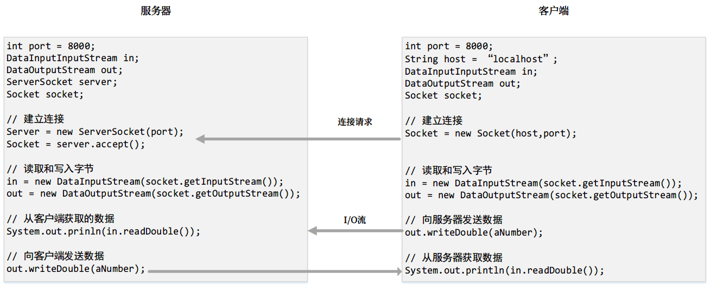

## 网络常识
*互联网协议（Internet Protocol,IP）*： IP地址可以用来唯一地标识互联网上的计算机。

*域名服务器（DNS）*： 将主机名字转换成IP地址。比如将www.baidu.com解析成111.13.100.92。

互联网协议是在互联网中从一台计算机向另一台计算机以包的形式传输数据的一种低层协议。两个和IP一起使用的比较高层的协议是传输控制协议（TCP）和用户数据报协议（UDP）。

*TCP（传输控制协议）* 能够让两台主机建立连接并交换数据流。TCP确保数据的传送，也确保数据包以他们发送的顺序传送。

*UDP（用户数据报协议）* 是一种用在IP之上的标准的、低开销的、无连接的、主机对主机的协议。UDP允许一台计算机上的应用程序向另一台计算机上的应用程序发送数据报。

Java支持基于流的通信和基于包的通信。基于流的通信使用传输控制协议（TCP）进行数据传输，而基于包的通信使用用户数据报协议（UDP）。因为TCP协议能够发现丢失的传输信息并重新发送，所以，传输过程是无损的和可靠的。相对而言，UDP协议不能保证传输没有丢失。因此，大多数Java程序设计采用基于流的通信。

## 客户端/服务器计算

Java提供ServerSocket类创建服务器套接字，Socket类来创建客户端套接字。Internet上的两个程序通过使用I/O流的服务器套接字和客户端套接字进行通信。

Java API提供用于创建字的类来便于程序通过Internet通信。套接字（socket）是两台主机之间逻辑连接的端点，可以用来发送和接收数据。

网络程序设计通常涉及一个服务器和一个或多个客户端。客户端想服务器发送请求，而服务器相应请求。客户端从尝试建立与服务器的连接开始，服务器可能接受或拒绝这个连接。一旦建立连接，客户端和服务器就可以通过套接字进行通信。

当客户端尝试连接到服务器时，服务器必须正在运行。服务器等待来自客户端的连接请求。

### 服务器套接字

要创建服务器，需要创建一个服务器套接字（server socket），并把它附加到一个端口上，服务器从这个端口监听连接。端口标识套接字上的TCP服务。端口号的范围为0 ~ 65536,但是0 ~ 1024是为特定服务保留的端口。比如电子邮件服务器运行在端口25上，Web服务器通常运行在端口80上。

```Java
// 服务器主机
// 步骤1：在一个端口上创建一个服务器套接字
ServerSocket serverSocket = new ServerSocket(8000);
// 步骤2：创建一个套接字连接到客户端，服务器通过下面语句监听连接
Socket socket= serverSocket.accept();

// 客户端主机
// 客户端程序使用以下语句连接到服务器
Socket socket = new Socket(serverHost,8000);
```
如果试图在已经使用的端口上创建服务器套接字，就会导致java.net.BindException异常。

serverHost主机名可以用IP和域名地址，如果是域名地址会要求DNS将主机名转换成IP地址

如果不能找到主机的话，Socket构造方法就会抛出一个异常java.net.UnknowHostException

### 通过套接字进行数据传输

服务器接受连接后，服务器和客户端之间的通信就像输入输出（I/O）流一样进行操作。



**注意：** 由于文本I/O需要编码和解码，所以，二进制I/O的效率比文本I/O的效率更高。因此，最好使用二进制I/O在服务器和客户端之间进行数据传输，一遍提高效率。

[服务器客户端应声虫](../Code/MyServer/Server.java)

## InetAddress类
服务器程序可以使用InetAddress类来获得客户端的IP地址和主机名字等信息

```Java
InetAddress inetAddress = socket.getInetAddress();
System.out.println("获取主机名："+inetAddress.getHostName());
System.out.println("获取主机IP："+inetAdddress.getHostAddress());

// 还可以使用静态方法getByName通过主机名或IP地址创建一个InetAddress实例
InetAddress address = InetAddress.getByName("www.google.com");
```

## 服务多个客户
一个服务器可以为多个客户端提供服务。对每个客户端的连接可以由一个线程来处理。

```Java
while (true){
    Socket socket = serverSocket.accept();
    Thread thrad = new ThreadClass(socket);
    thread.start();
}
```

服务器套接字可以有多个连接。while循环的每次迭代创建一个新的连接。无论何时，只要创建一个新的连接，就创建一个新线程来处理服务器和新客户端之间的通信，这样，就可以有连接同时运行。

[多客户端连接](../Code/multiThreadServer/MultiThreadServer.java)

### java.net.SocketException: Connection reset异常
```Java
    java.net.SocketException: Connection reset
    at java.net.SocketInputStream.read(SocketInputStream.java:196)
    at java.net.SocketInputStream.read(SocketInputStream.java:122)
    at java.net.SocketInputStream.read(SocketInputStream.java:108)
``` 
经查阅问题描述如下：
1. 如果一端的Socket被关闭（或主动关闭，或因为异常退出而 引起的关闭），另一端仍发送数据，发送的第一个数据包引发该异常(Connect reset by peer)。

2. 一端退出，但退出时并未关闭该连接，另一端如果在从连接中读数据则抛出该异常（Connection reset）。简单的说就是在连接断开后的读和写操作引起的。

我这里是客户端，socket最后关闭，原因只能是2。说明对方在把数据返回后，就把socket关闭了，而客户端还在读数据。所以就connection reset。

解决方案；
使用InputStream.available判定是否还有可读字节
available()

## 发送和接收对象

一个程序可以向另一个程序发送和接收对象。ObjectOutputStream和ObjectInputStream不仅可以发送接收基本类型的数据。也可发送接收对象。为了能够进行传输，这些对象必须是可序列化的。
